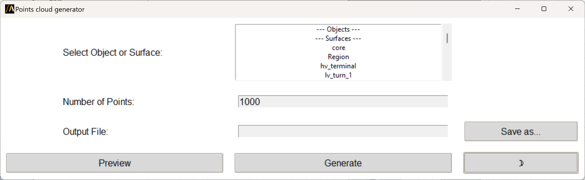

Point cloud generator
=====================

With this extension, you can generate point cloud that conform to objects and surfaces.

You can access the extension from the icon created on the **Automation** tab using the Extension Manager.

The following image shows the extension user interface:

This extension relies on the PyVista point cloud, a collection of points in 3D space,
typically used to represent the shape or surface of an object.
Each point in the cloud is defined by its own coordinates (x, y, z).
Selected objects are defined by an OBJ file which is a standard 3D model format used to represent 3D geometries.
It contains information about the vertices, vertex normals, and texture coordinates of the model, as well as the faces that make up the 3D object.
The extension first reads a mesh data from the OBJ file and loads it into a PyVista mesh object (mesh).
The mesh is then converted into a triangulated form. This means that all the faces of the mesh are broken down into triangles.
The triangulated mesh is then used to generate a point cloud. The point cloud is created by sampling points from the surface of the mesh.

The extension generates a PTS file in the working directory.

For HFSS designs, it enables conformal domains for near-field calculations.

You can also launch the extension user interface from the terminal. An example can be found here:

.. toctree::
   :maxdepth: 2

   ../commandline