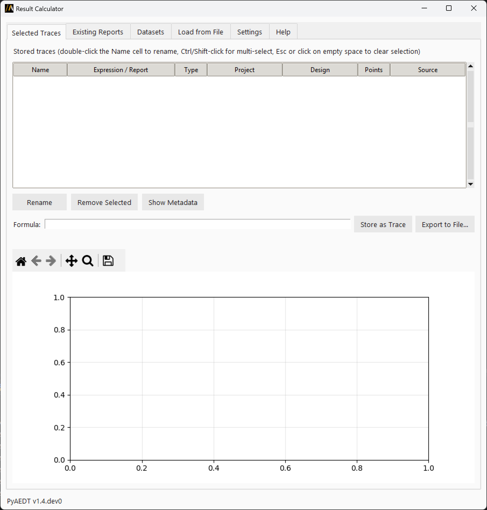
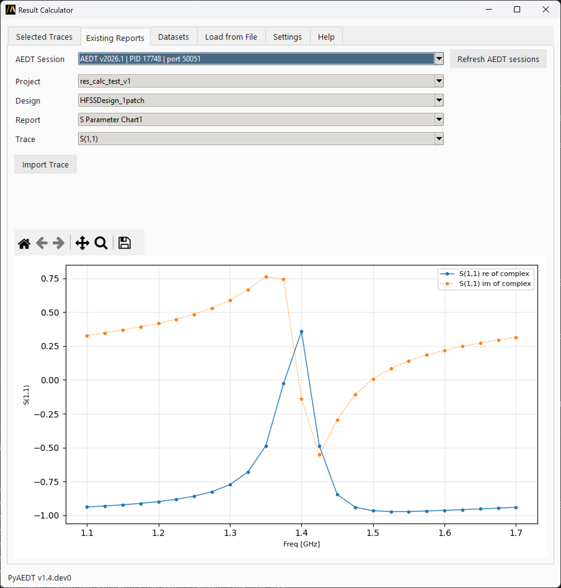
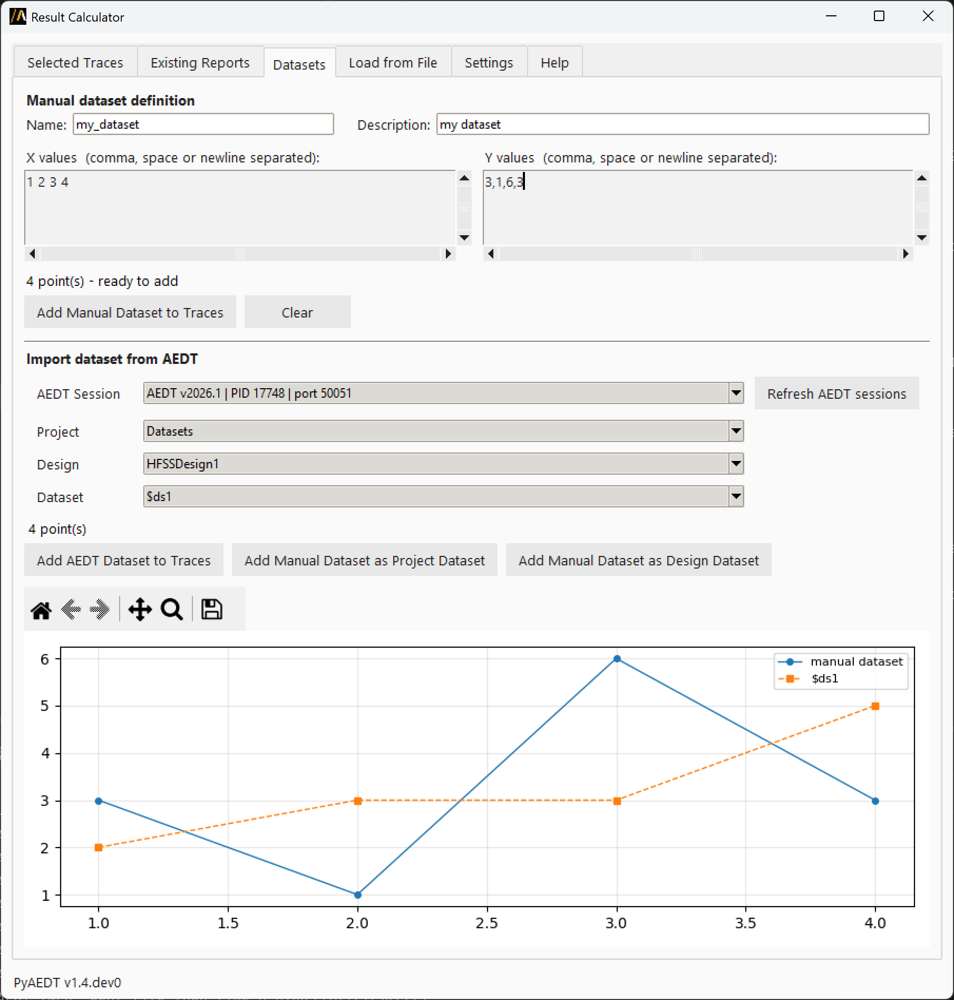
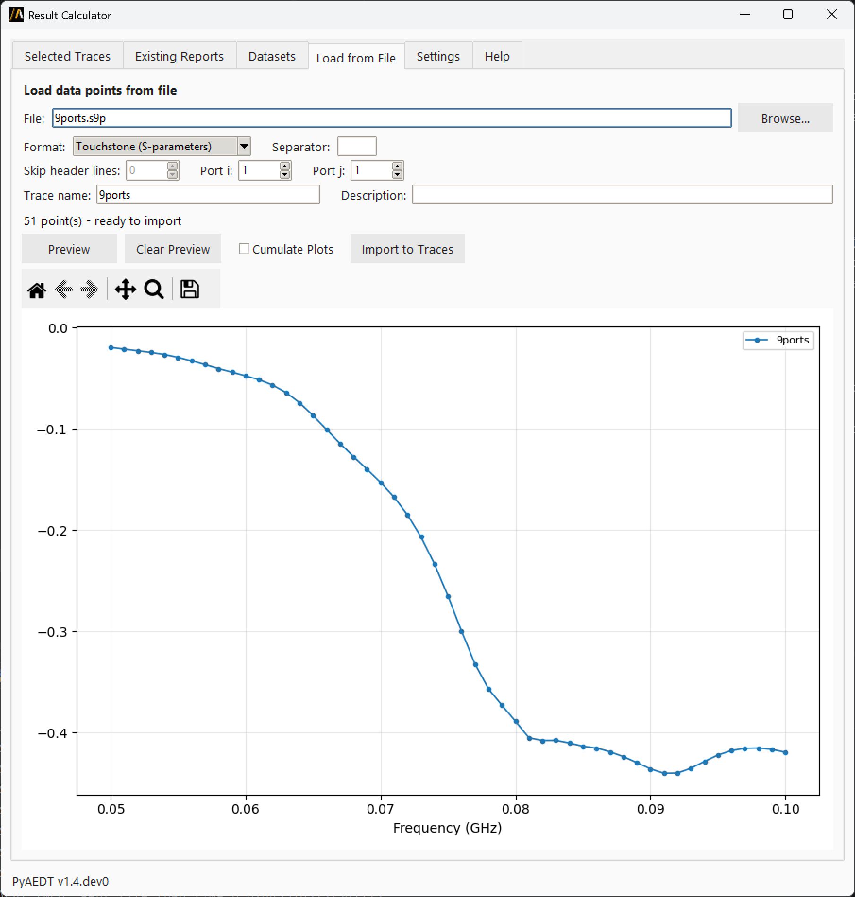
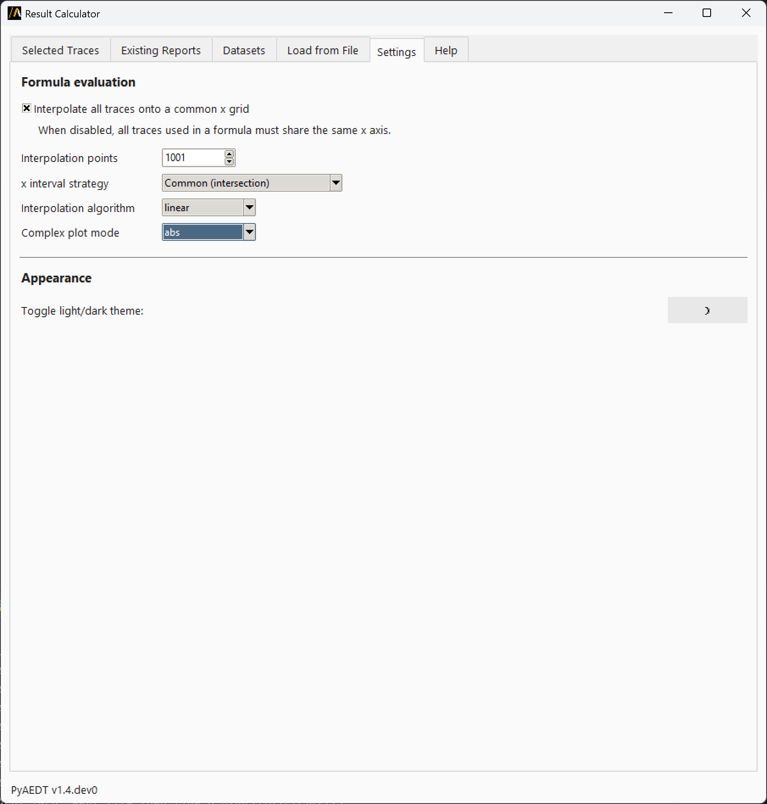

Result Calculator
==================

The Result Calculator extension allows you to collect, plot, and manage result traces from one or more AEDT sessions.
You can import traces from existing reports, load datasets, read from files, and perform mathematical calculations over
traces with support for complex values and different x-axis grids.

Overview
========

This extension provides a comprehensive GUI for:

- **Importing traces** from AEDT reports and datasets
- **Managing traces** from multiple AEDT sessions simultaneously
- **Performing calculations** using mathematical formulas with support for complex numbers
- **Exporting results** to multiple file formats (CSV, TSV, JSON, NPZ, TXT)
- **Plotting and visualizing** data with interactive plots
- **Creating and loading datasets** by manual entry or directly from AEDT
- **Loading external data** from various file formats including Touchstone files

Main Tabs
=========

Selected Traces
---------------

This tab displays all imported or calculated traces. You can:

- Select one or more rows to plot them together (Ctrl+click or Shift+click for multi-selection, click on an empty area to deselect all)
- Double-click a trace name to rename it inline
- Enter mathematical expressions in the formula bar (formulas are validated in real-time)
- View live formula results as you type
- Store calculated results as new permanent traces (named ``ans1``, ``ans2``, etc.)
- Export formula results to file in multiple formats

**Supported file formats for export:**

- **CSV (.csv)** – Comma-separated values, two columns (x and y)
- **TSV (.tsv)** – Tab-delimited, two columns (x and y)
- **JSON (.json)** – x and y as lists, plus formula metadata
- **NumPy archive (.npz)** – Binary NumPy format
- **NumPy text (.txt)** – Plain-text two-column NumPy format

**Formula capabilities:**

- Use trace names as variables (e.g., ``result_1 - result_2``, ``20*log10(abs(R))``)
- Mix real and complex traces in calculations
- Access NumPy functions: ``log10()``, ``abs()``, ``sqrt()``, ``sin()``, ``cos()``, etc.
- Use mathematical constants: ``pi``, ``e``, ``inf``, ``nan``
- Reference NumPy directly with ``np.`` prefix for advanced operations
- The calculation engine does not verify whether operations are dimensionally or physically meaningful.

**Supported data types:**

- 2D traces (x/y pairs) with real or complex values
- 3D traces are not supported

Existing Reports
----------------

Browse and import traces from reports already open in AEDT sessions. This tab allows you to:

- Select an AEDT session from the dropdown
- Navigate through projects, designs, and reports
- Choose specific traces to preview
- Preview raw x/y data automatically (displayed in a chart below)
- Click "Import Trace" to import the selected traces into the Selected Traces tab

The preview chart loads automatically once a trace is selected, showing exactly what will be imported.

Datasets
--------

This tab has two sections:

**Manual Entry section:**

- Enter x and y values directly in text boxes (space or comma-separated)
- Define a name and an optional description for the dataset
- Click "Add Manual Dataset to Traces" to import the defined dataset in Selected Traces
- Click "Clear" to reset the input fields
- The imported dataset becomes available for use in calculations tab

**AEDT Datasets section:**

- Browse 2D datasets defined in AEDT projects (supports both project and design datasets)
- Select a dataset and click "Import Dataset" to add it to Selected Traces
- Click "Add Manual Dataset as Project Dataset" or "Add Manual Dataset as Design Dataset" to push a manually defined dataset into the selected AEDT project or design

Load from File
--------------

Import data from disk files in supported formats:

- **CSV files** – Comma-separated values
- **Tab-separated files** – TSV format
- **Custom separator** – Specify any character as separator
- **Touchstone files** (.sNp) – Network parameter data
- **Other text files** – With configurable parsing options

Features:

- Browse and select files from disk
- Configure parsing options:

  - delimiter (comma, tab, space, or custom)
  - header rows to skip
  - columns to read (x and y)
  - for Touchstone files, specify the S-parameter index

- Click "Preview" to plot parsed data before importing
- Click "Clear Preview" to reset the preview plot (selecting a new file automatically clears the preview)
- Click "Cumulate Plots" to overlay multiple columns/ports selection in the preview chart
- Click "Import to Traces" to import the selected data directly in Selected Traces

Settings
--------

Settings tab allows you to configure how the extension handles data and displays information.

**Interpolation settings:**

Configure how the formula evaluator handles traces with different x-axis grids:

- **Interpolate all traces onto a common x grid** – Align traces to a common x-axis grid (recommended for formulas)
- **Interpolation points** – Resolution of the output interpolation grid (default: 301)
- **x interval strategy** – Choose between:

  - ``"common"`` (default) – Use the intersection of all x-axis ranges
  - ``"extended"`` – Use the union and extrapolate missing data

- **Interpolation algorithm** – Algorithm used for interpolation:

  - ``"linear"`` (default) – Fast and smooth
  - ``"quadratic"`` – Higher accuracy
  - ``"cubic"`` – Highest accuracy
  - ``"nearest"`` – Step function

- **Complex plot mode** – Chose how to display complex data in plots:

  - ``"abs"`` – Magnitude (default)
  - ``"abs + phase"`` – Magnitude and Phase angle in degrees
  - ``"real + imag"`` – Real and imaginary parts

**UI Settings:**

- Switch between light and dark themes
- View PyAEDT version information

Help
----

Built-in help with:

- Quick reference for all tabs
- Trace naming conventions
- Tips for using the extension
- Code examples for reloading exported files in Python

Working with AEDT Sessions
===========================

**Session dropdown:**

The AEDT Session dropdown at the top of the Existing Reports and in Datasets tabs selects which running AEDT
instance to read from. This extension allows you to work with multiple AEDT instances simultaneously.
The extension support graphical and non graphical sessions, as well as student versions.
All data is cached locally to speed up browsing and importing traces.

**Refresh AEDT sessions:**

Click "Refresh AEDT sessions" to detect newly opened instances or clear stale session data from the cache.
Imported traces are stored in the extension and are not affected by session refreshes.

**Session information:**

The dropdown shows:

- AEDT version
- Process ID (PID)
- Network port
- Student version indicator
- Non-graphical mode indicator
- Current process indicator

Trace Naming
============

Trace names follow these conventions:

- **Valid characters:** Letters, digits, and underscores only
- **Imported traces:** Named ``result_1``, ``result_2``, etc.
- **Formula results:** Named ``ans1``, ``ans2``, etc.
- **Renaming:** Double-click any trace name in the table to rename it inline

Tips and Tricks
===============

- **Quick Help:** Press ``F1`` from anywhere to jump to the Help tab
- **Deselect all:** Click the empty area below the trace table to deselect all traces and view only the live formula curve
- **Chart toolbar:** Use the toolbar below each chart for zoom, pan, and save-image controls
- **Reload NumPy binary:** ``d = np.load('file.npz'); x, y = d['x'], d['y']``
- **Reload NumPy text:** ``data = np.loadtxt('file.txt'); x, y = data[:, 0], data[:, 1]``

Complex Numbers
===============

The extension supports traces with complex values:

- Formulas can mix real and complex traces
- In the Selected Traces tab, a dropdown allows you to choose how to display complex results

Troubleshooting
===============

**No AEDT session available:**

Make sure at least one AEDT instance is running before trying to import reports or datasets.
Click "Refresh AEDT sessions" to detect newly opened instances.

**Trace import fails:**

- Verify the design and report are available in the selected AEDT session
- Try refreshing the session list
- Check that the report contains at least one trace with x/y data

**Formula evaluation errors:**

- Verify trace names are spelled correctly (case-sensitive)
- Ensure traces have compatible x-axis ranges for interpolation
- Check that mathematical operations are valid (e.g., avoid division by zero)
- Adjust interpolation settings if traces have very different x-axis ranges

**File import issues:**

- Verify file format matches the selected import options
- Check that CSV/TSV files have at least two columns (x and y)
- For Touchstone files, verify the file format (.s1p, .s2p, etc.)
- Use the Preview feature to diagnose parsing issues

API Usage Example
=================

The extension is launched from AEDT using PyAEDT Extension Manager.
The extension can also be used standalone from the command line:

.. code:: bash

    python result_calculator.py

Alternatively, you can import and launch it programmatically:

.. code:: python

   import tkinter
   from ansys.aedt.core.extensions.common.result_calculator import (
       ResultCalculatorExtension,
   )

   # Create and display the extension
   ext = ResultCalculatorExtension(withdraw=False)

   # Keep the window alive
   tkinter.mainloop()

**Note:**

- When launched standalone, the extension can still connect to any running AEDT session via the Session dropdown, allowing you to import reports and datasets from multiple AEDT instances.
- The extension cannot be used programmatically to import traces from AEDT sessions or perform calculations without the GUI.
