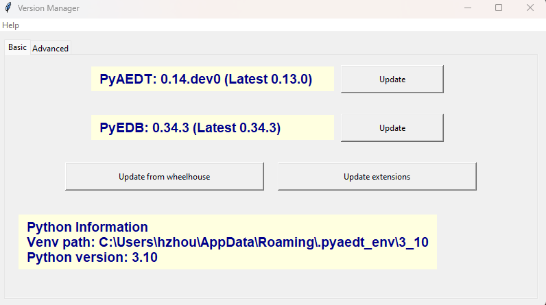

The extension allows users to update PyAEDT and PyEDB through GUI
-----------------------------------------------------------------

----------
Features
----------

- Show Python virtual environment path
- Show Python version
- Show the current PyAEDT&PyEDB versions
- Show the latest PyAEDT&PyEDB release
- Update PyAEDT&PyEDB to the latest version
- Replace PyAEDT&PyEDB with specific version
    - Default is main, which is the developer version
    - Accepted inputs are branch name and version (0.34.0 for example)
- Update PyAEDT&PyEDB from wheelhouse
  - Check compatibility
- Reset and update PyAEDT buttons in AEDT
