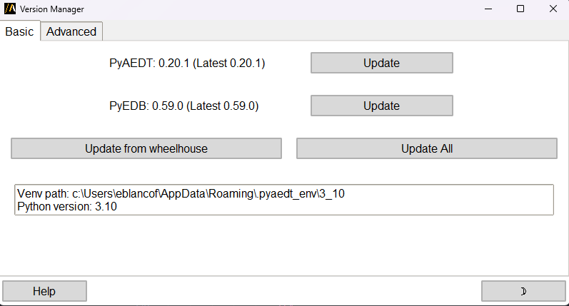
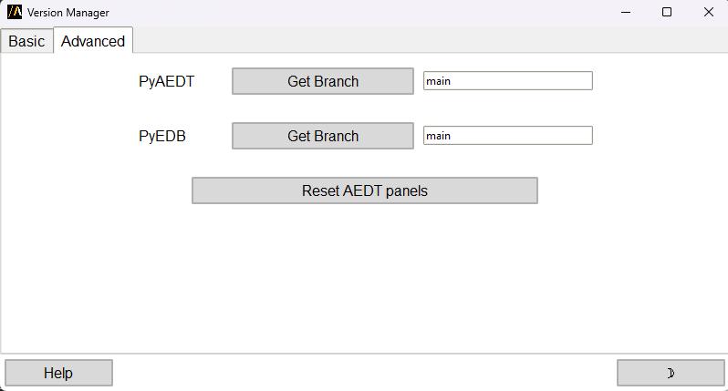

The extension allows users to update PyAEDT and PyEDB through GUI
-----------------------------------------------------------------

Overview
========
A lightweight panel to view your Python environment and manage the two core
packages: ``pyaedt`` and ``pyedb``. It lets you see what is installed, compare
with the latest PyPI releases, update (or downgrade to the latest official
release), install from a Git branch, or install from a wheelhouse ZIP.

Main actions
============
- Show virtual environment path and Python version
- Show installed and latest PyPI versions of ``pyaedt`` and ``pyedb``
- Update one or both packages (Update / Update All)
- Install a package from a Git branch
- Install ``pyaedt`` from a validated wheelhouse ZIP
- Reset PyAEDT buttons inside AEDT
- Open help page (Help button)

Tabs
====
Basic: Versions, Update buttons, Update All, Wheelhouse install.

Advanced: Git branch install fields and Reset AEDT panels.

Quick: Install from Git branch
==============================
1. Go to Advanced tab.
2. Enter branch name (default is ``main``).
3. Click Get Branch and confirm.

Quick: Update from wheelhouse
=============================
1. Click Update from wheelhouse (Basic tab).
2. Pick the wheelhouse ZIP.
3. If compatible, it installs new ``pyaedt[all]`` and refreshes the panels.

Notes
=====
- Uses ``uv pip`` when available; falls back to ``python -m pip`` automatically.
- Git must be on PATH for branch installs.
- Wheelhouse ZIP must match Python version and OS.
- A downgrade occurs only if your installed version is newer than the latest
  release on PyPI.

Troubleshooting
===============
- Missing buttons after update: Reset AEDT panels (Advanced tab).
- PyPI lookup fails: check network / proxy and retry.
- Git branch install fails: verify branch name and that Git is installed.
- Wheelhouse rejected: confirm Python version and OS match.

Disclaimer
==========
A confirmation dialog appears before any install or update involving
third-party/open-source software. Proceed only if you accept the terms.
