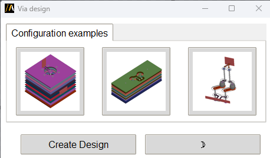

Via design
==========

------------
Introduction
------------

This extension generates a parameterized PCB or package via design from a configuration file. The configuration file can
be modified for the sake of customization in terms of stackup, fanout layer, pitch size, etc.

----------
How to use
----------

1, Click any of the via design icon, and save the example configuration file to your local drive.

2, Open the configuration file in a text editor, and modify it for your application.

3, Click ``Create Design``, and browse to the configuration file.
