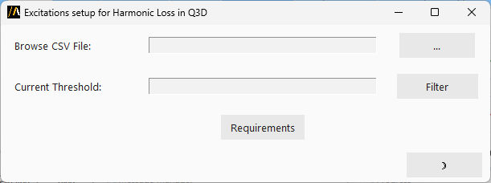

Harmonic Loss in Q3D
====================

This extension allows to import CSV data as a design dataset and edit Q3D sources with the imported data.
The user can filter the CSV data given a current threshold and then import the filtered data as a design dataset.
Finally, the extension edits the Q3D sources with the imported design dataset.

The following image shows the extension user interface:

The user must select the CSV file to import and specify the current threshold to filter the data.
The CSV file must follow the format of the output CSV file generated by the transient analysis in either Ansys Circuit or Ansys Twinbuilder.
The CSV file must contain the following columns: **Spectrum[Hz]**, **re(source_name.I) [A]**, **im(source_name.I) [A]** (real and imaginary parts of the current for each source).

[Image of the CSV file format]

The user can also set the threshold to filter the data.
The extension will only import the rows where the absolute value of both real and imaginary current is greater than the specified threshold.

The extension will save a CSV file with the filtered data in the project working directory and saves real and imaginary part in separate tab-separated files.
Each .tab file will contain two columns: frequency and the corresponding part (real or imaginary).
Each .tab file will be imported as a design dataset in Q3D and the extension will edit the Q3D sources with the imported design datasets.