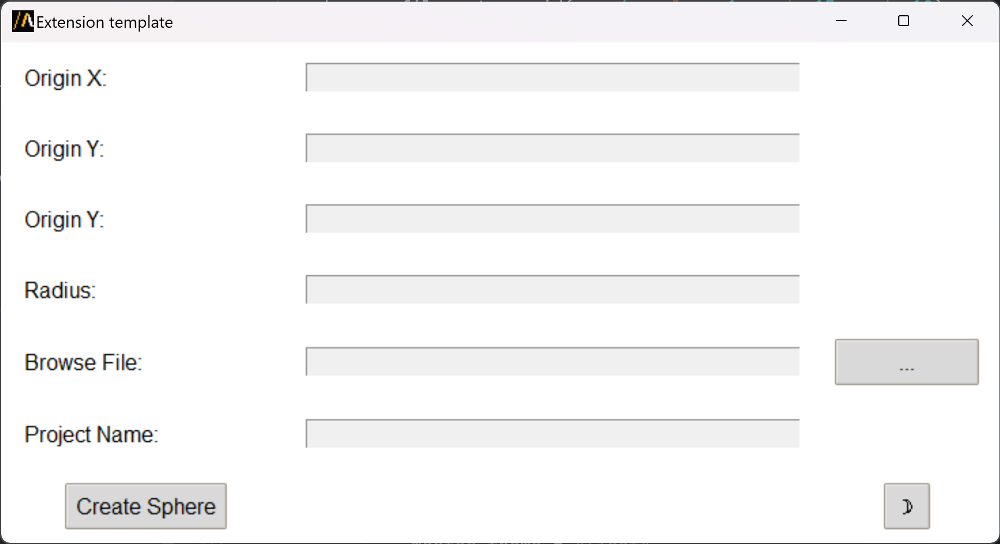

Extension template
==================

Template to help the user create an extension from scratch.

The extension provides a graphical user interface for configuration, or it can be used in batch mode via command line arguments.

The following image shows the extension user interface:

Features
--------

- Create a sphere providing information such as the origin coordinates and radius.
- Allow users to browse and select an **.aedt** file to load in AEDT.
- Display name of the active project.
- Support of light and dark themes for the GUI.

Run the extension
-----------------

The extension can be run from a Python script in the following way:

.. code:: python

    import ansys.aedt.core
    import os

    from ansys.aedt.core.extensions.templates.template_get_started import main

    hfss = ansys.aedt.core.Hfss()

    # Specify the AEDT session to connect
    os.environ["PYAEDT_DESKTOP_PORT"] = str(hfss.desktop.port)
    os.environ["PYAEDT_DESKTOP_VERSION"] = hfss.desktop.aedt_version_id

    main({"origin_x": 2, "radius": 6, "is_test": True})

Command line
------------

The extension can also be run directly via the command line for batch processing.

The script accepts the following arguments:
- ``**origin_x**`` : x origin coordinate.
- ``**origin_y**`` : y origin coordinate.
- ``**origin_z**`` : z origin coordinate.
- ``**radius**`` : radius.
- ``**file_path**`` : file path to the **.aedt** file.

Use the following syntax to run the extension:

.. toctree::
   :maxdepth: 2

   ../commandline