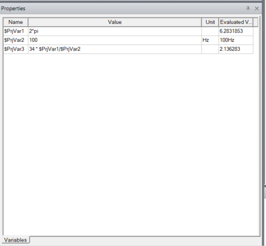

Variables
=========

PyAEDT provides a simplified interface for getting and setting variables inside a project or a design.
You simply need to initialize a variable as a dictionary key. If you use ``$`` as the prefix 
for the variable name, a project-wide variable is created:

.. code:: python

    from pyaedt import Hfss
    with Hfss as hfss:
         hfss["dim"] = "1mm"   # design variable
         hfss["$dim"] = "1mm"  # project variable

.. image:: ../Resources/aedt_variables.png
  :width: 800
  :alt: Variable Management

With Variable Manager, you can create advanced equations and manage them through PyAEDT.

While you can set or get the variable value using the app's setter and getter, you can
access the ``variable_manager`` object for a more comprehensive set of functions:

.. code:: python

        >>> hfss["$PrjVar1"] = "2*pi"
        >>> hfss["$PrjVar2"] = "100Hz"
        >>> hfss["$PrjVar3"] = "34 * $PrjVar1/$PrjVar2"
        >>> hfss["$PrjVar3"]
        2.13628300444106
        >>> hfss.evaluate_expression(hfss["$PrjVar3"])
        2.13628300444106
        hfss.variable_manager["$PrjVar3"].expression
        '34 * $PrjVar1/$PrjVar2'

Optimetrics
===========

Optimetrics allow you to set up parametric analysis, sensitivity analysis, optimization,
and Design of Experiments (DOE). PyAEDT provides the capability to seamlessly interact with
optimetrics setups by allowing users to read existing configurations, make edits, and create new setups:

.. code:: python

    from pyaedt import Maxwell3d
    m3d = Maxwell3d()
    m3d.parametrics.add("Rload", 0.1, 1, 0.1)

.. image:: ../Resources/Optimetrics_Parametric.png
  :width: 800
  :alt: Optimetrics creation

