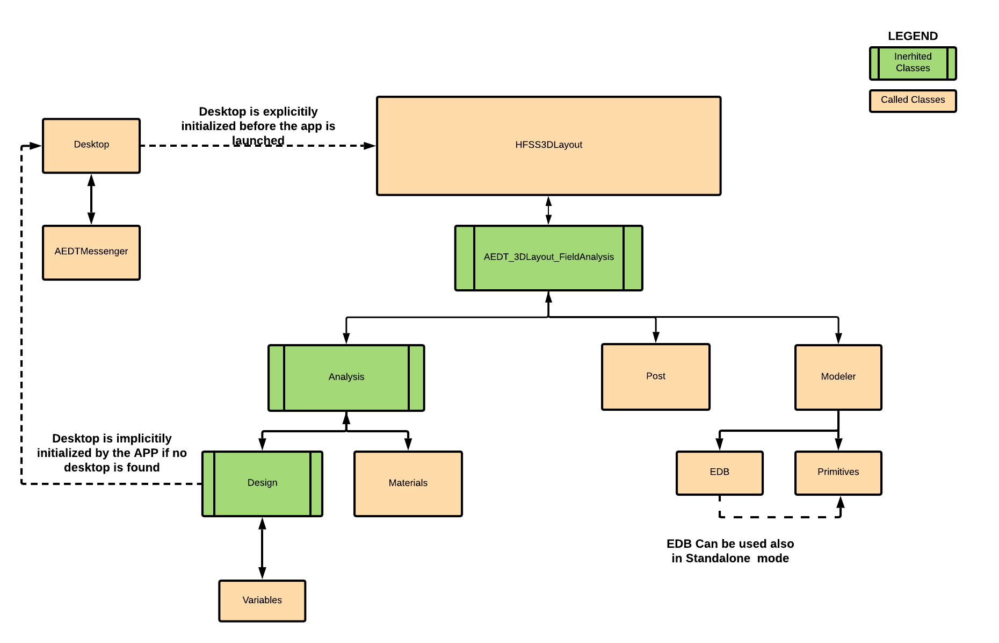
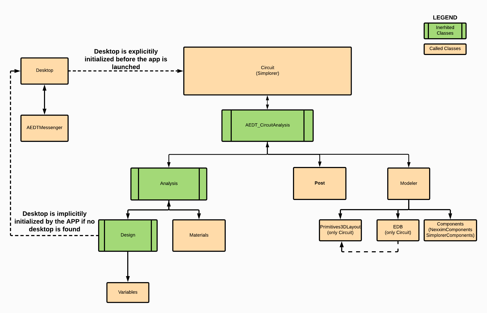

PyAEDT Documentation
====================

Introduction
------------

PyAEDT is intended to consolidate and extend all existing
functionalities around AEDT-based scripting to allow re-use of
existing code, sharing of best-practice and increase collaboration
collaboration.  PyAEDT is licensed under `MIT License <LICENSE.html>`_

This tool includes functionality to interact with HFSS, Icepak and Maxwell 3D.

**What is PyAEDT**

PyAEDT is an Python library which interacts directly with the AEDT API to make scripting simpler for the end user.
It uses an architecture that can be reused for all 3D tools (Maxwell, Q3D, HFSS, Icepak), and in future for all other desktop tools. Its classes and methods structures simplifies operation for end-user while reusing as much as possible of the information across the API.

**Why PyAEDT**

Recording and reusing script is a very fast approach for simple operations in Desktop UI. However:

- Code recorded is dirty and difficult to read and understand.
- Difficult to resuse and adapt recorded scripts.
- Complex Coding is a need for many global users of AEDT.

Main advantages of PyAEDT are:

- Automatic initialization of all the AEDT Objects (e.g. desktop objects like editor, boundaries, etc…)
- Error Management
- Log management
- Variable Management
- Compatibility with IronPython and CPython.
- Simplification of complex API syntax using to Data Objects while maintaining PEP8 compliance.
- Code reusability across different solvers.
- Docstrings on functions for better understanding and tool usage.
- Unit Test of code to increase quality across different AEDT Version

.. figure:: ./Resources/BlankDiagram3DModeler.png
    :width: 600pt

    pyaedt Architecture Overview for 3D Solvers
    PyAEDT Architecture Overview for 3D Solvers

    pyaedt Architecture Overview for HFSS 3DLayout/EDB Solver
    PyAEDT Architecture Overview for HFSS 3DLayout/EDB Solver

    pyaedt Architecture Overview for Circuit Solvers (Nexxim/Simplorer)
    PyAEDT Architecture Overview for Circuit Solvers (Nexxim/Simplorer)

**Usage Workflow**

Start AEDT by
1. Initializing Desktop Class with version of AEDT to be used.
2. Initializing the application used within AEDT

**Desktop.py - Connect to Desktop from Python IDE**

- Works inside Electronics Desktop and as a Standalone Application.
- Automatically detect if it is IronPython or CPython and initialize the Desktop
- Advanced Error Management

Examples of usage:

- Explicit Desktop declaration and error management:

.. code:: python

    from pyaedt.Destkop import Desktop
    from pyaedt.Circuit import Circuit
    with Desktop("2020.1", NG=True):
        print("AEDT 2020R1 in Non-Graphical mode will be launched)
        circuit = Circuit()
        ...
        print("any error here will be caught by Desktop...")
        ...
    print("Desktop is automatically released here")

- Implicit Desktop Declaration and error management:

.. code:: python

    from pyaedt.Circuit import Circuit
    with Circuit as circuit:
        print("Latest version of Desktop in Graphical mode will be launched")
        ...
        print("Any error here will be caught by Desktop...")
        ...
    print("Desktop is automatically released here")

- Variables

.. code:: python

    from pyaedt.HFSS import HFSS
    with HFSS as hfss:
         hfss["dim"] = "1mm"   # this is a design variable
         hfss["$dim"] = "1mm"  # this is a project variable

- modeler

.. code:: python

    from pyaedt.HFSS import HFSS
    with HFSS as hfss:
         # Same command to create the box, assign variables, and assign materials
         hfss.modeler.primitives.create_box([0, 0, 0], [10, "dim", 10], "mybox", "aluminum")

.. toctree::
   :hidden:

   LICENSE
   Resources/Installation
   API/API
   examples/index
   Resources/Code_Guidelines

Style Guide
~~~~~~~~~~~
PyAEDT follows the PEP8 style guidelines.  See the following links for additional details.

- `Coding Guidelines <Resources/Code_Guidelines.md>`_

- `Installation Guidelines <Resources/Installation.md>`_

- `PEP 8 <https://www.python.org/dev/peps/pep-0008/>`_

- `Clean Code - R. C. Martin <https://www.amazon.com/Robert-Martin-Clean-Code-Collection-ebook/dp/B00666M59G>`_

Indices and tables
==================
* :ref:`genindex`
* :ref:`modindex`
* :ref:`search`
